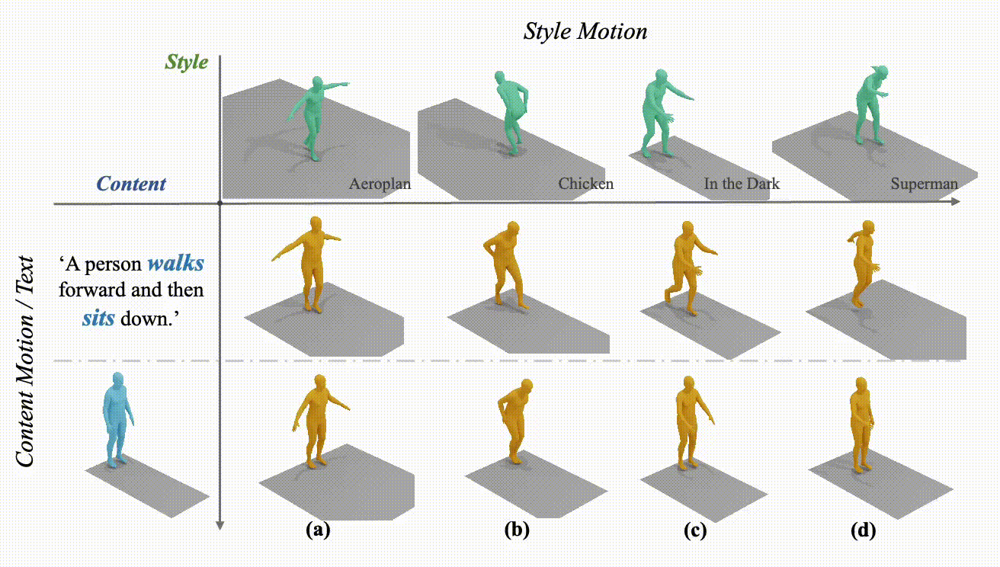

# SMooDi: Stylized Motion Diffusion Model
### [Project Page](https://neu-vi.github.io/SMooDi/) | [Paper](https://arxiv.org/pdf/2407.12783)

> SMooDi: Stylized Motion Diffusion Model  
> [Lei Zhong](https://zhongleilz.github.io/), [Yiming Xie](https://ymingxie.github.io), [Varun Jampani](https://varunjampani.github.io/), [Deqing Sun](https://deqings.github.io/), [Huaizu Jiang](https://jianghz.me/)    



## Citation
If you find our code or paper helpful, please consider starring our repository and citing:
```bibtex
@article{zhong2024smoodi,
      title={SMooDi: Stylized Motion Diffusion Model},
      author={Zhong, Lei and Xie, Yiming and Jampani, Varun and Sun, Deqing and Jiang, Huaizu},
      journal={arXiv preprint arXiv:2407.12783},
      year={2024}
}
```

## TODO List
- [x] Release retargeted 100STYLE dataset.
- [x] Code for Inference and Pretrained model.
- [x] Evaluation code and metrics.
- [x] Code for training.

## Retargeted 100STYLE Dataset
We have released the retargeted 100STYLE dataset, mapped to the SMPL skeleton, available on [Google Drive](https://drive.google.com/drive/folders/1P_aQdSuiht3gh1kjGkK4KBt_9i9ARawy?usp=drive_link).

### Processing Steps for the 100STYLE Dataset:
1. **Retargeting with Rokoko**: We used Rokoko to retarget 100STYLE motions to the SMPL skeleton template in BVH format. You can refer to this [Video Tutorial](https://www.youtube.com/watch?v=Nyxeb48mUfs) for a detailed guide on using Rokoko.

2. **Extracting 3D Joint Positions**: After obtaining the retargeted 100STYLE dataset in BVH format, we utilized [CharacterAnimationTools](https://github.com/KosukeFukazawa/CharacterAnimationTools) to extract 3D joint positions.

3. **Deriving HumanML3D Features**: Following the extraction, we used the instructions in the `motion_representation.ipynb` notebook available in [HumanML3D](https://github.com/EricGuo5513/HumanML3D) to derive the HumanML3D features.

## PRETRAINED_WEIGHTS
Available on [Google Drive](https://drive.google.com/drive/folders/12m_v_vybVeAQFkH9bP8wmJIxJhGoIJL1?usp=sharing).

## Getting started
This code requires:

* Python 3.9
* conda3 or miniconda3
* CUDA capable GPU (one is enough)

### 1. Setup environment

Install ffmpeg (if not already installed):

```shell
sudo apt update
sudo apt install ffmpeg
```
For windows use [this](https://www.geeksforgeeks.org/how-to-install-ffmpeg-on-windows/) instead.

Setup conda env:
```shell
conda env create -f environment.yml
conda activate omnicontrol
python -m spacy download en_core_web_sm
pip install git+https://github.com/openai/CLIP.git
```

Download dependencies:

```bash
bash prepare/download_smpl_files.sh
bash prepare/download_glove.sh
bash prepare/download_t2m_evaluators.sh
```


### 2. Get data

#### Full data (text + motion capture)

**HumanML3D** - Follow the instructions in [HumanML3D](https://github.com/EricGuo5513/HumanML3D.git),
then copy the result dataset to our repository:

```shell
cp -r ../HumanML3D/HumanML3D ./dataset/HumanML3D
```

**100STYLE** - Download the dataset from Google Drive, then copy the files in texts, new_joints, and new_joint_vecs into their corresponding directories within ./dataset/HumanML3D. We use indices larger than 030000 to represent data from the 100STYLE dataset.

### 3. Download the pretrained models

1. Download the model(s) you wish to use, then unzip and place them in `./save/`. 
2. Download the pretrained model from [MLD](https://github.com/ChenFengYe/motion-latent-diffusion) and then copy it to `./save/`. 


## Motion Synthesis
Please add the content text to ./demo/test.txt and the style motion to ./test_motion, then run:
```shell
bash demo.sh
```

Tips:
For some motion styles, the default parameter settings may not achieve the desired results. You can modify the `guidance_scale_style` in `config_cmld_humanml3d.yaml` to achieve a better balance between content preservation and style reflection.


## Train your own SMooDi
You can train your own model via
```shell
bash train.sh
```

Tips:
1. In `config_cmld_humanml3d.yaml`, setting `is_recon: True` means that cycle loss will not be used during training. 
2. If you want to quickly train a model, you can set `is_recon: True`. With this setting, it will take nearly 50 minutes to train 50 epochs on an A5000 GPU and achieve performance nearly equivalent to the second row in Table 3 of our paper. 
3. In fact, the improvement in performance from cycle loss is quite limited.


## Evaluate
You can evaluate model via
```shell
bash test.sh
```

Tips:
1. Make sure to set `is_test: True` during evaluation.
2. In `config_cmld_humanml3d.yaml`, setting `is_guidance: True` means that classifier-based style guidance will be used during evaluation. If `is_guidance: False`, evaluation will take nearly 50 minutes, whereas it will take 4 hours if `is_guidance: True` on an A5000 GPU.

## Acknowledgments

Our code is heavily based on [MLD](https://github.com/ChenFengYe/motion-latent-diffusion).  
The motion visualization is based on [MLD](https://github.com/ChenFengYe/motion-latent-diffusion) and [TMOS](https://github.com/Mathux/TEMOS). 
We also thank the following works:
[guided-diffusion](https://github.com/openai/guided-diffusion), [MotionCLIP](https://github.com/GuyTevet/MotionCLIP), [text-to-motion](https://github.com/EricGuo5513/text-to-motion), [actor](https://github.com/Mathux/ACTOR), [joints2smpl](https://github.com/wangsen1312/joints2smpl), [MoDi](https://github.com/sigal-raab/MoDi), [HumanML3D](https://github.com/EricGuo5513/HumanML3D), [OmniControl](https://github.com/neu-vi/OmniControl).

## License
This code is distributed under an [MIT LICENSE](LICENSE).  

Note that our code depends on several other libraries, including SMPL, SMPL-X, and PyTorch3D, and utilizes the HumanML3D and 100STYLE datasets. Each of these has its own respective license that must also be adhered to.
